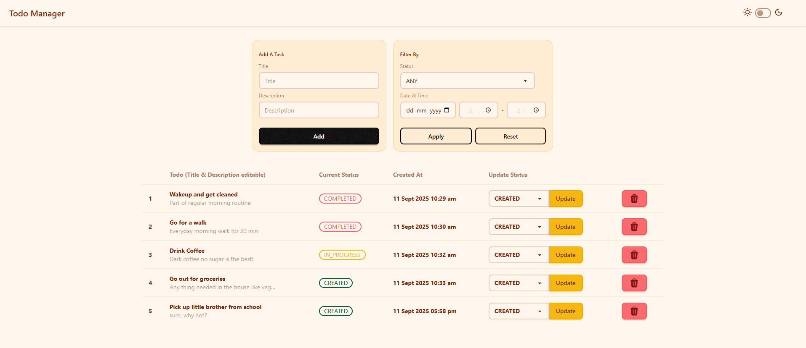
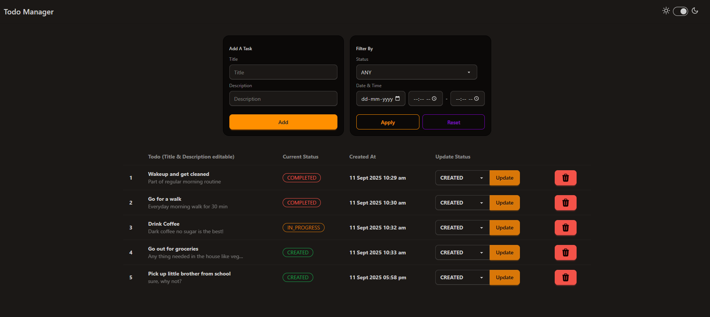

A simple task manager application using Spring Boot MVC, Thymeleaf, PostgreSQL

-> Create, manage, delete todos\
-> Change status to track the current state of todo\
-> Change themes

Light Mode

Dark Mode

